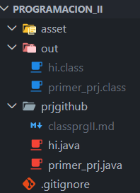

# INTRODUCCION A PROGRAMACION II

----

## Proyecto principal : Bienvenida

PROGRAMACION II/
├── .git/                # Configuración de Git

├── asset/               # Capturas e imágenes

│   └── Archivos_prj.png

├── out/                 # Archivos compilados (.class)

├── prjgithub/           # Carpeta de ejercicios Java

│   └── primer_prj.java

├── .gitignore           # Archivos ignorados por Git

└── README.md            # Documentación del proyecto

